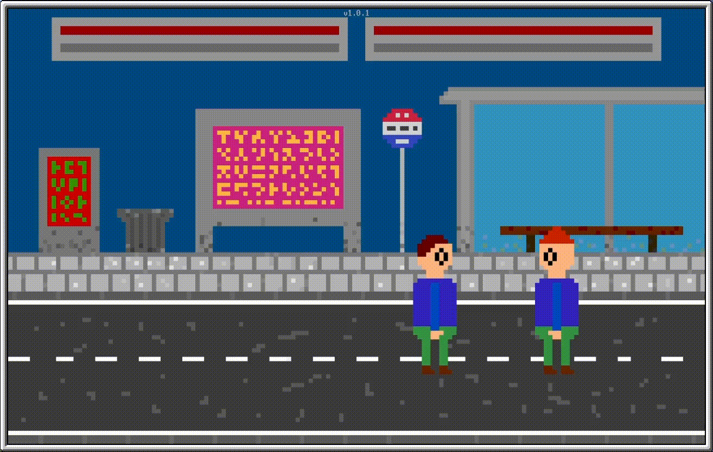

# About
StreetPuncher2 is 1v1 street fighting game for the minecraft mod OpenComputers.
As the successor of [StreetPuncher](https://github.com/MisterNoNameLP/StreetPuncher) it mostly keeps the original gameplay while getting some complete graphics overhaul.



# Controls
The controls can be changed in the `controls.ini` file

Defaults:  
```
player1 left = A  
player1 right = D  
player1 punch = S  

player2 left = J  
player2 right = L  
player2 punch = K  
```

# Performance
The performance of StreetPuncher2 highly depents on the power of the CPU minecraft is running on.  
So if the game runns at low FPS running minecraft on a server or client with stronger CPU can help.  
But keep in mind that due to technical limitation of minecraft itself, FPS above 20 will not be visible.  

# System requirements
Grapics cart: tier 3  
Memory: 8MB  
Disk storage: 1.8MB

# Instalation
If you have an internet card installed you can simply run this command line to install the game into the current dir: `wget https://raw.githubusercontent.com/NosPo-Studio/StreetPuncher2/main/StreetPuncher2_installer.lua .streetpuncher2_installer.lua; ./.streetpuncher2_installer.lua StreetPuncher2; rm .streetpuncher2_installer.lua`.

If you want to install it manually you can copy the `StreetPuncher2-v1.0.1_installer.lua` onto your disc and execute it.

# Potential issues
### Installer or game crashes
Try to reboot the PC. If that does not help try to run the program at a fresh openOS install.

# Engine
StreetPuncher2 is build ontop of the [NosGa Engine](https://github.com/NosPo-Studio/NosGa-Engine) so it come with all its benefits.

# License
StreetPuncher2 is licensed under the GPLv3.

StreetPuncher2 Copyright (C) 2022 NosPo Studio.

This program is free software: you can redistribute it and/or modify it under the terms of the GNU General Public License as published by the Free Software Foundation, either version 3 of the License, or (at your option) any later version.

This program is distributed in the hope that it will be useful, but WITHOUT ANY WARRANTY; without even the implied warranty of MERCHANTABILITY or FITNESS FOR A PARTICULAR PURPOSE. See the GNU General Public License for more details.

You should have received a copy of the GNU General Public License along with this program. If not, see https://www.gnu.org/licenses/.